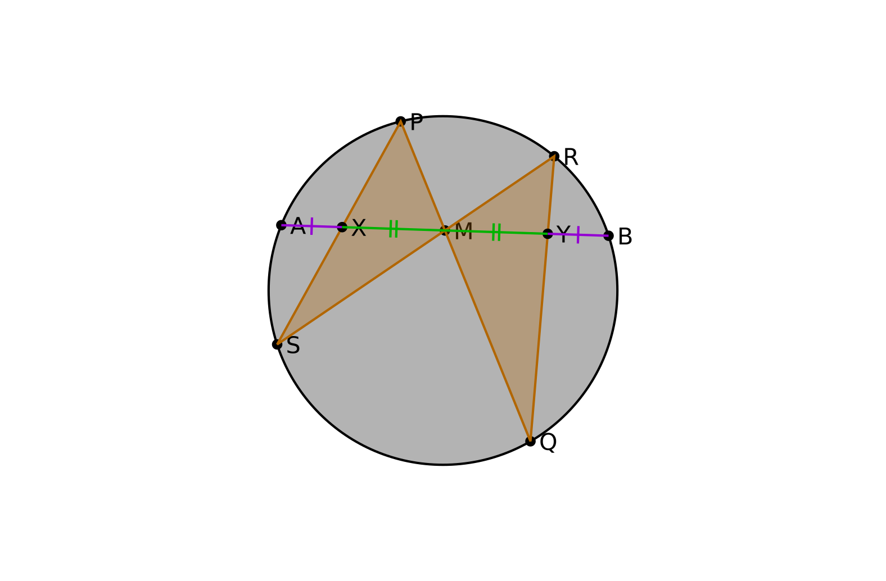

[](https://github.com/ilyasm0919/geometry/releases/latest)
[](https://github.com/ilyasm0919/geometry/releases)

# Geometry


Geometry viewer and editor for Android and desktop (macOS, Linux, Windows)

# Tutorial

## Basic syntax

Geometry uses code-like definitions.

Points are represented as *complex numbers*.
The center of screen is `0` and short side is `200`,
so the same code would look the same on all devices.

Lets draw triangle:

```
A = 20+60i
B = 60-40i
C = -60-40i
t = triangle(A, B, C)
```


## Styles

Lets make our triangle orange, fill it, and make border dashed
```
A = 20+60i
B = 60-40i
C = -60-40i
[orange] [fill] [dash] t = triangle(A, B, C)
```


## Constructors

In the reality, function `triangle` expects *triangle* (and returns it), *not three points*.

But the following rules work:
* when function expects *triangle* you can put *three points* to it
* when function expects *segment* you can put *two point* to it
* when function expects *line* you can put *segment* or *two points* to it
* when function expects *circle* you can put *two points* (center and some point on circle) to it
* when function expects *polygon* you can put *arbitrary many points* to it
* `Complex` and `Point` in functions signatures are synonyms

## Movable points

Lets allow moving of our points in the view mode:
```
A = #(20+60i)
B = #(60-40i)
C = #(-60-40i)
[orange] [fill] t = triangle(A, B, C)
```


## Moving by traectory

Lets choose arbitrary point on BC and try to move it:

```
A = #(20+60i)
B = #(60-40i)
C = #(-60-40i)
[orange] [fill] t = triangle(A, B, C)

D = project(#(-40i), B, C)
```



## Technical details of points moving

When you define `X = ... #(...) ...`
X will be evaluated as if there is no `#` and
the anchor for `#` will be created where X is.
You will be able to move this anchor and expression in parens
will be replaced by position of anchor.

So, the code like `X = #(0) + 50` will work contrintuitive.

## Animation (dynamic objects)

Your code can use *time* to animate the drawing.
Lets, for example, animate point `D` from [moving by traectory](#moving-by-traectory) chapter:

```
A = #(20+60i)
B = #(60-40i)
C = #(-60-40i)
[orange] [fill] t = triangle(A, B, C)

D = choose(segment(B, C), time()/500)
```

The `choose` function chooses a point on given object (segment or circle):
it smoothly moves with second parameter increasing
and reaches initial value when second parameter reaches integer


## Ambiguity

Some geometric constructions is *ambiguous*: they have many results.
For example, line and circle intersects in *two points*.

Such functions have 3 variations:
* returning *first* (in some not obvious sense) result
* returning *second* result
* returning *other* result

To use last way, you must provide one of results.
For example, lets intersect line with circle:

```
O = 0
c = circle(O, 60)
A = cproject(#(45+40i), c)
l = line(A, O)

B = cintersect(A, l, c)
```


# Examples

* [Butterfly theorem](examples/butterfly.geo)


---

* [Trillum theorem](examples/trillum.geo)


---

* [First sparrow lemma](examples/sparrow.geo)


---

* [Bicyclists lemma](examples/bicyclists.geo)



# Installing

Currently, only Windows and Android versions are builded.
You can download it here:

* [The latest release](https://github.com/ilyasm0919/geometry/releases/latest)
* [Other builds](https://github.com/ilyasm0919/geometry/releases)

For Linux and macOS you can build app from
[source](https://github.com/ilyasm0919/geometry/tree/main/GeometryDesktop)
